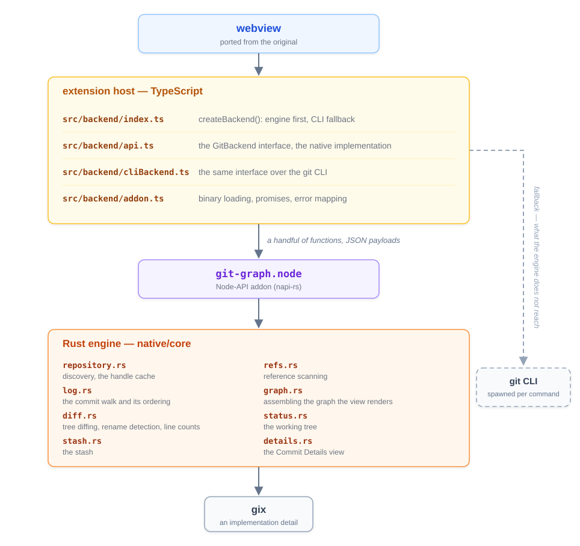

# Git Graph (Rust)

[](https://marketplace.visualstudio.com/items?itemName=neophack.git-graph-rs)
[](https://marketplace.visualstudio.com/items?itemName=neophack.git-graph-rs)
[](https://open-vsx.org/extension/neophack/git-graph-rs)
[](https://github.com/neophack/vscode-git-graph-rs/actions/workflows/native-build.yml)
[](https://codecov.io/gh/neophack/vscode-git-graph-rs)

A rewrite of the Git Graph VS Code extension with its Git backend in Rust, loaded into the
extension host as a Node-API addon through [napi-rs] and reading repositories with [gix].

The original extension answered every question by spawning a `git` process and parsing its
output. This one reads the object database, the refs and the index directly, in-process, from a
repository handle that stays warm for the whole editor session. **Every repository read** — the
view load, commit/stash/uncommitted details, comparisons, file contents and diffs, search, config
— is served by the Rust engine; anything the engine does not reach, and the whole write path
(checkout, merge, rebase, push, …), goes through the `git` CLI behind the same interface.

**Install** it from the
[Visual Studio Code Marketplace](https://marketplace.visualstudio.com/items?itemName=neophack.git-graph-rs)
(search for "Git Graph RS") or [Open VSX](https://open-vsx.org/extension/neophack/git-graph-rs),
or download a VSIX from [GitHub Releases](https://github.com/neophack/vscode-git-graph-rs/releases)
and install it with `code --install-extension git-graph-rs-<version>.vsix`.

Bug reports, feature requests and questions go to
[the issue tracker](https://github.com/neophack/vscode-git-graph-rs/issues).

## What this fork adds

Beyond the Rust engine, these are new relative to the original
[mhutchie/vscode-git-graph](https://github.com/mhutchie/vscode-git-graph):

- **A Gerrit integration, rebuilt.** Per-repository change-ref fetching, a change badge on every
  commit with its change/patchset number and Code-Review/Verified scores, a review dialog with the
  full NoteDb event timeline and an "Open in Gerrit" button, and an open/merged/abandoned/WIP
  status filter. The NoteDb meta histories are parsed in-process by the engine; the remote is only
  contacted when the user asks (Fetch, enabling the integration, changing its fetch settings) —
  every plain view load works offline from the locally cached refs. Configured through
  `git-graph-rs.gerrit.remote`, `git-graph-rs.gerrit.fetchLimit` (default 20, overridable per
  repository) and `git-graph-rs.gerrit.showReviewProgress`.
- **Gerrit commands in the Source Control view**: push the current branch for review to
  `refs/for/<branch>` (adding a Change-Id to HEAD first, exactly as Gerrit's commit-msg hook does,
  and never amending a commit already pushed to a remote), and install the commit-msg hook from
  the Gerrit server.
- **Data-loss protection** on the write operations that can silently strand work — see
  [Data-loss protection](#data-loss-protection).
- **A Simplified Chinese interface** (`git-graph-rs.interfaceLanguage`: auto / English / 简体中文)
  covering the webview, the extension host messages and the Source Control menus.
- **Instant first paint, progressive completion.** A view load renders the local branch and tag
  pills immediately from a local-only ref scan, merges the remote pills in when the full scan
  arrives, and chains the "Uncommitted Changes" row and the Gerrit stages onto the same pipeline.
  Commit details render their file list first and settle the `+N/-M` line counts progressively.
- **A graph that stays current by itself.** A repository file watcher plus a 5-second background
  poll of the ref/HEAD/stash signature means a commit made from a terminal or another tool appears
  on the graph within seconds. Re-showing an already-rendered view soft-refreshes it instead of
  regenerating the HTML, so switching tabs back never blank-flashes.
- **Binary file comparison**: a streaming hex view that byte-compares the matched equal suffix,
  and a picture mode that dyes differing pixels and reports PSNR.
- **Amend Last Commit** and **Reset Current Branch to Remote (soft)** in the Source Control view.
- **Runs without Git installed** — the whole read path is served in-process by the engine; write
  operations report that they need Git. Conversely, on a platform with no prebuilt engine binary
  the extension runs entirely over the `git` CLI.

## Performance

The numbers below compare **the backend the extension actually ships** with **what the original
extension does**:

- *shipped* — what `createBackend()` hands the extension on this machine: the Rust engine wrapped
  in the `git` CLI fallback. An operation the engine declines is timed as the user experiences it,
  fallback spawn included, not as the engine alone.
- *git CLI* — the bare `CliBackend`, one `git` spawn per call, which is what the original
  extension does for everything.

Both sides are driven through the same `GitBackend` interface with the same arguments;
`node scripts/bench.mjs <repo> --all` reproduces the tables. Each number is the median of 11
runs after an untimed warm-up (the engine's caches and the OS page cache are warm, so this is the
steady-state interaction, not the first cold open).

Environment: Windows 11, Intel i7-14650HX, Node 24, git 2.50.1, extension 1.0.23.

### A real repository (129 commits, 23 tags, uncommitted changes in the working tree)

| operation | git CLI | shipped | speedup |
|---|---:|---:|---:|
| **view load** (repoInfo + first page — what the user waits for) | 331.1 ms | 69.0 ms | **4.8×** |
| getRepoInfo (branches/tags/remotes/stashes) | 170.9 ms | 11.3 ms | **15.1×** |
| getCommits (a page of the graph) | 203.9 ms | 63.8 ms | **3.2×** |
| getRefs | 141.2 ms | 13.6 ms | **10.4×** |
| getCommitDetails | 129.1 ms | 3.3 ms | **38.7×** |
| getLineCounts (the details view's deferred counts) | 46.7 ms | 4.4 ms | **10.6×** |
| getCommitBodies (50 commits) | 76.9 ms | 12.2 ms | **6.3×** |
| getCommitSummaries (50 commits) | 116.5 ms | 11.0 ms | **10.6×** |
| getCommitSubject | 41.5 ms | 0.7 ms | **60.6×** |
| searchHistory ('' matches everything) | 74.8 ms | 36.2 ms | **2.1×** |
| getConfig | 68.2 ms | 0.2 ms | **432×** |
| getStashes | 47.3 ms | 0.5 ms | **94.3×** |
| getUncommittedChangeCount | 59.7 ms | 15.1 ms | **3.9×** |
| compareCommits | 64.2 ms | 25.5 ms | **2.5×** |
| countCommitsBefore | 70.7 ms | 35.1 ms | **2.0×** |
| getCommitFile | 45.3 ms | 1.3 ms | **36.2×** |
| getCommitFileDiff | 98.1 ms | 4.0 ms | **24.6×** |
| getCurrentBranchUpstream | 45.4 ms | 0.7 ms | **68.3×** |
| getRemoteUrl | 42.6 ms | 0.1 ms | **458×** |

### Synthetic repository (10 000 commits, 1 000 annotated tags, one ~9.5 MiB pack)

| operation | git CLI | shipped | speedup |
|---|---:|---:|---:|
| **view load** (repoInfo + first page of 300) | 429.7 ms | 96.5 ms | **4.5×** |
| getRepoInfo (branches/tags/remotes/stashes) | 198.7 ms | 31.8 ms | **6.2×** |
| getCommits (a page of the graph) | 240.5 ms | 55.8 ms | **4.3×** |
| getRefs | 118.8 ms | 29.7 ms | **4.0×** |
| getCommitDetails | 125.7 ms | 0.7 ms | **185×** |
| getLineCounts (the details view's deferred counts) | 47.8 ms | 0.9 ms | **53.5×** |
| getCommitBodies (50 commits) | 67.2 ms | 0.7 ms | **95.2×** |
| getCommitSummaries (50 commits) | 66.8 ms | 0.5 ms | **123×** |
| getCommitSubject | 51.1 ms | 0.1 ms | **353×** |
| searchHistory ('' matches everything) | 74.7 ms | 37.1 ms | **2.0×** |
| getConfig | 69.6 ms | 0.1 ms | **481×** |
| getStashes | 50.7 ms | 0.4 ms | **133×** |
| getUncommittedChangeCount | 52.8 ms | 12.0 ms | **4.4×** |
| compareCommits | 49.8 ms | 0.9 ms | **55.0×** |
| countCommitsBefore | 63.4 ms | 33.8 ms | **1.9×** |
| getCommitFile | 48.3 ms | 0.2 ms | **217×** |
| getCommitFileDiff | 96.0 ms | 0.6 ms | **169×** |
| getCurrentBranchUpstream | 47.8 ms | 0.6 ms | **79.5×** |
| getRemoteUrl | 44.9 ms | 0.1 ms | **334×** |
| getTagDetails (annotated tag) | 46.7 ms | 0.3 ms | **149×** |

`getSubmodules` is omitted: on a repository without a `.gitmodules` the CLI backend answers from
the working tree without spawning anything, so both sides take ~0.1 ms.

### What the numbers say

- **The view load — the number the user waits for on every open — is 4–5× faster.** Page size
  is capped at 300 commits, so the shipped backend's cost stays roughly flat as the history grows,
  while the CLI's is dominated by ref scanning and pack reads on top of several process spawns.
- **Single-object reads win by one to two orders of magnitude** (`getConfig`, `getRemoteUrl`,
  `getCommitSubject`, `getStashes`, `getCurrentBranchUpstream`, `getCommitDetails`). On the CLI
  side each costs one `git` spawn — a ~40–70 ms floor on Windows — while the warm repository
  handle answers in well under a millisecond. The gap does not narrow as the repository grows,
  because the spawn is the cost.
- **Full-history walks are where the two come closest** (`searchHistory` with a pattern that
  matches everything, `countCommitsBefore`): the work is proportional to the history and `git`'s
  walker is highly optimised. The shipped backend still leads, by about 2× rather than 100×.

### Why it is faster

Four things account for the gap, each found by measuring rather than by guessing:

1. **The repository stays open.** A `git` spawn re-reads the pack index files before doing any
   useful work, and a single view load makes several such calls. The engine opens a repository
   once and keeps its pack indexes and object cache resident.
   ([`repository.rs`](native/core/src/repository.rs))
2. **Refs are filtered by name before any object is read.** A ref the view is not showing costs a
   string comparison and nothing more, and remote-tracking refs are never peeled. On a Gerrit
   remote whose `changes/` tree holds tens of thousands of refs, this is the difference between
   reading all of them and reading none. ([`refs.rs`](native/core/src/refs.rs))
3. **Revisions that are already hashes skip the revspec parser.** The tips of a view load come
   straight from the refs that were just read, so they are looked up directly rather than sent
   through gix's revision parser — which was, on its own, 4× the cost of the whole walk.
4. **One call crosses the boundary per request, not one per commit.** Results are serialised once
   in Rust and parsed once in JavaScript rather than built property by property over Node-API.
   ([`native/node/src/lib.rs`](native/node/src/lib.rs))

## Architecture



Three rules hold the shape together:

1. **Rust is the Git engine and nothing else.** It knows nothing about VS Code, never shells out,
   and is exercised by `cargo test` with no Node in the picture.
2. **TypeScript does the UI and the VS Code API, and never parses Git itself.**
3. **gix is an implementation detail.** Nothing above `native/core` names it.

The *lane* layout — which column a commit's dot sits in — deliberately stays in the webview: it is
a rendering decision that depends on the viewport.

### The fallback

`createBackend()` returns the Rust engine wrapped so that anything it cannot answer reaches the
`git` CLI instead. Only two kinds of failure are fallen back over: *this is not a repository I can
open*, and *I do not implement this*. A genuine Git failure — a bad revision, a corrupt object —
**is** the answer, and re-running it through `git` would produce the same failure more slowly.

On a platform with no prebuilt binary the CLI backend is used alone and the extension behaves
exactly as the original did; the Settings widget's **Backend** section shows which areas run on
which backend on this machine. Which operations the engine serves and which still spawn `git` is
documented in [docs/BACKENDS.md](docs/BACKENDS.md).

The write path (checkout, merge, rebase, stash operations, remotes, tags) is not on the
`GitBackend` interface yet and still spawns `git` directly, exactly as the original did;
[GAPS.md](GAPS.md) is the inventory of what is missing.

Correctness is checked against Git itself: the engine's tests build fixture repositories with the
`git` command line and compare every reader to what git reports, and `tests/backends.test.mjs`
runs **both backends over the same repository through the same interface**, asserting they agree
field by field — the webview cannot tell which one it is talking to, so any disagreement is a
user-visible behaviour change.

## Known deviations from git

- **Signatures are verified by Git when a CLI is available.** The engine reads signature presence
  in-process; verification is delegated to Git/GPG so the status, key id and signer match the
  user's keyring. Without Git the status stays `E` ("cannot be checked").
- **Ordering reads a bounded window.** gix's traversal offers no topological guarantee, so a window
  of commits — a multiple of the requested page — is collected and re-ordered here. Ordering is
  exact within the window; a commit never appears before one of its children.
- **A comparison against the working tree shows no line counts**, because getting them means
  hashing every worktree file, which costs more than the counts are worth on the critical path.
- **Line counts arrive after the file list.** Opening a commit renders its files first and settles
  the `+N/-M` counts progressively; everywhere except a working-tree comparison they are exact once
  settled.

## Data-loss protection

Some write operations can lose work that no ref keeps reachable — silently, because the `git`
command that does it exits successfully. Those operations do not run on the first click: the view
shows a warning dialog stating the actual recoverability of the case, and only re-sends the action
when the user confirms. The guarded operations:

- **Leaving a detached HEAD that has its own commits** — switching branch, checking out another
  commit, or creating a branch elsewhere with checkout. After the switch those commits are
  reachable only from the reflog, and only until `git gc` prunes them. Creating the branch *at*
  HEAD anchors them, and so does a stash whose base is on them, so neither is asked.
- **A hard reset while the working tree has uncommitted changes.** Those contents are recorded in
  no reflog.
- **A force push.** The commits the remote has that the push does not contain become unreachable
  *there*. `--force-with-lease` is the guarded variant and is not confirmed a second time.

## Building

Requires Rust 1.85+ and Node 18+. There is no node-gyp, no Python and no download of Node
headers: napi-rs resolves the Node-API symbols at load time.

```sh
npm install
npm run build                    # the addon (debug) + the TypeScript
npm run build:native:release     # the addon as it ships
npm test                         # cargo tests + the cross-backend integration tests
npm run bench -- <repo-path>     # one view load, shipped backend vs git CLI
npm run bench:all -- <repo-path> # every read operation, one table row each (--json for machines)
npm run lint                     # clippy + rustfmt
```

On Windows, `build-and-install.bat` runs the whole chain — addon, TypeScript, webview, tests —
packages the VSIX and installs it into VS Code, stopping at the first failure.

While `git-graph-rs.enableLog` is on, every spawned `git` command is logged with its duration and
every engine→CLI fallback with its reason; `node scripts/analyze-log.mjs <logfile>` summarises a
session log into where the time went and which methods fell back.

Cross-compiling goes through [`@napi-rs/cli`](https://napi.rs):
`node scripts/build-addon.mjs --release --target <triple>` builds one target, `build-rust.bat`
builds the four common ones from a Windows host (`--full` adds Windows arm64 and macOS x64).
Foreign-OS targets use `cargo-zigbuild` (no Apple SDK needed); Windows arm64 links with `rust-lld`
against the Windows SDK. What the engine depends on is documented in
[docs/DEPENDENCIES.md](docs/DEPENDENCIES.md).

## Supported platforms

The engine is built for the six platforms VS Code itself ships for. The four common ones ship by
default; Windows arm64 and macOS x64 are built only by a `full` release run, and on them the
extension otherwise runs over the `git` CLI.

| Platform | Target | Ships by default |
|---|---|---|
| Windows x64 | `x86_64-pc-windows-msvc` | ✅ |
| Windows arm64 | `aarch64-pc-windows-msvc` | full runs only |
| Linux x64 | `x86_64-unknown-linux-gnu` | ✅ |
| Linux arm64 | `aarch64-unknown-linux-gnu` | ✅ |
| macOS x64 | `x86_64-apple-darwin` | full runs only |
| macOS arm64 | `aarch64-apple-darwin` | ✅ |

A platform whose binary is missing is still fully functional: the extension detects at load time
that no engine matches `process.platform` + `process.arch` and serves every query through the
`git` CLI, with an informational notice. The engine is a speed optimisation, never a requirement.
The reverse also holds: a machine without Git runs the whole read path on the engine alone, and
write operations report that they need Git.

## Releasing

[`native-build.yml`](.github/workflows/native-build.yml) builds one binary per platform on native
runners and assembles them into `native/<platform>/git-graph.node`, the layout the extension
loads from. [`release.yml`](.github/workflows/release.yml) is triggered by hand
(`gh workflow run release.yml -f version=vX.Y.Z`, add `-f full=true` for all six platforms); it
runs the whole pipeline and publishes a GitHub Release with two kinds of VSIX, nothing being
published unless every test passed:

- **the universal VSIX** (`git-graph-rs-<version>.vsix`) — every built engine in one package,
  `engines.vscode ^1.38.0`; the engine is picked at load time;
- **the per-platform VSIXs** (`git-graph-rs-<version>-<platform>.vsix`) — one engine each, built
  with `vsce package --target` and stamped `^1.61.0`, since only 1.61+ editors request
  platform-specific packages. Editors older than 1.61, and platforms with no package of their own,
  receive the universal VSIX as the Marketplace's documented fallback.

Publishing to the Marketplace is `vsce publish --packagePath <file>` per asset, the universal VSIX
first so the fallback exists, then each per-platform one.

## License & credits

The Rust engine (`native/`), the build scripts, the custom-made icons and the `git-graph-rs-*`
assets are original to this project and released under the [MIT license](LICENSE).

The webview and extension host layers are ported and modified from
[mhutchie/vscode-git-graph](https://github.com/mhutchie/vscode-git-graph), whose license
(`licenses/LICENSE_GIT_GRAPH`) does not permit publishing derivative works — see `LICENSE` for how
that applies to this repository. Further credits: the Visual Studio Code Git Extension (Askpass,
Find Git Executable — MIT), Octicons, vscode-icons and Icons8 for icons, and the [gix][gix] and
[napi-rs][napi-rs] ecosystems the engine builds on (MIT OR Apache-2.0). The full inventory lives
in [`licenses/THIRD-PARTY-NOTICES.md`](licenses/THIRD-PARTY-NOTICES.md).

[napi-rs]: https://napi.rs
[gix]: https://github.com/GitoxideLabs/gitoxide
